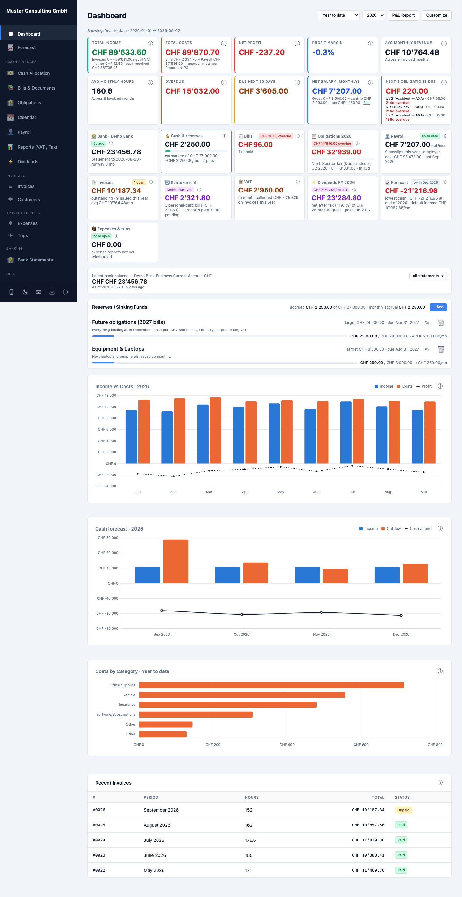
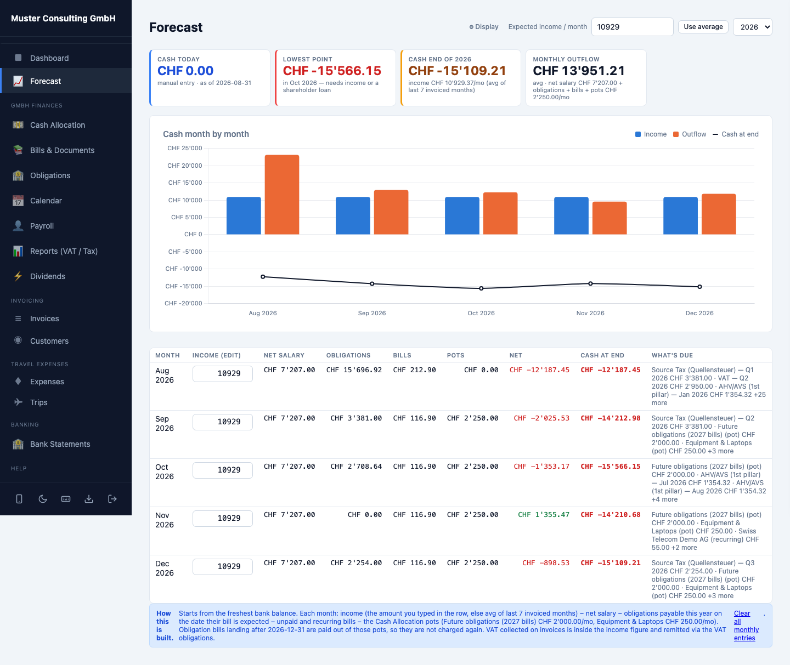
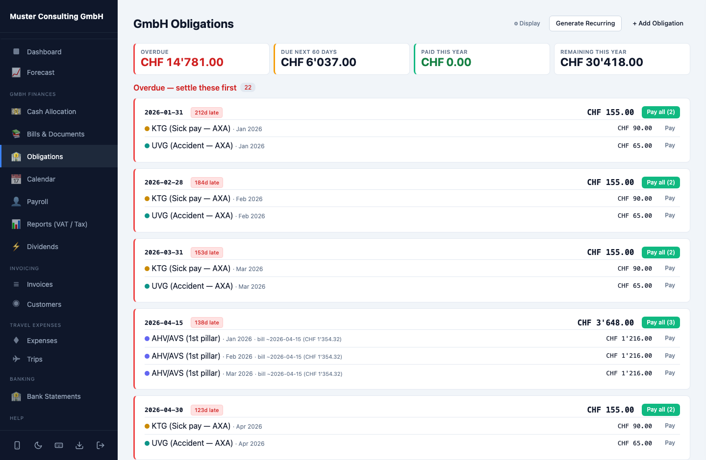
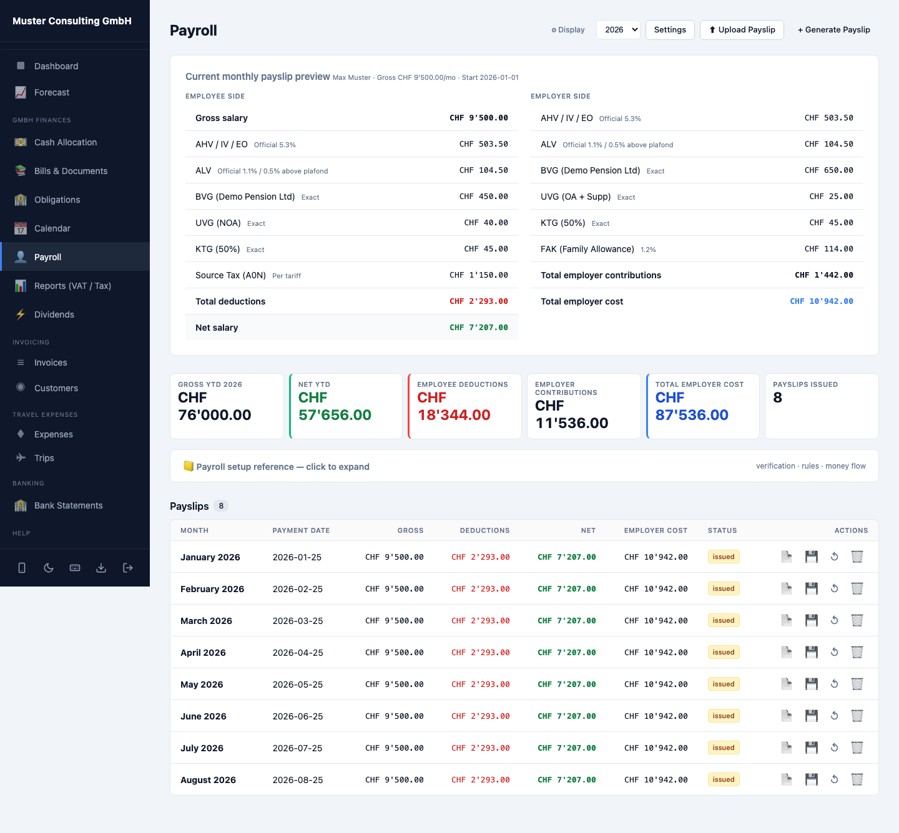
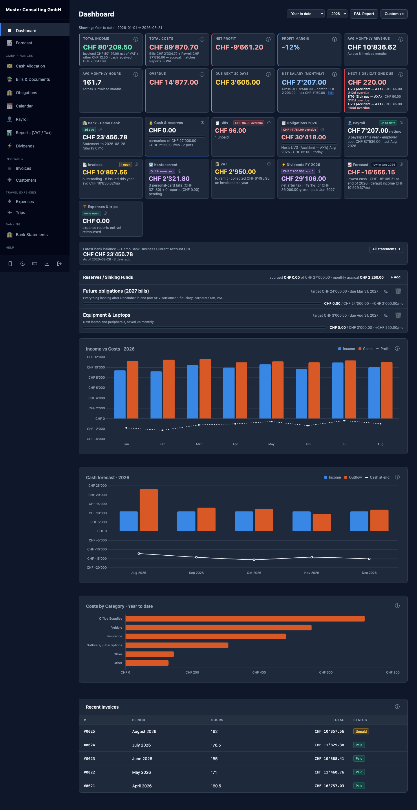
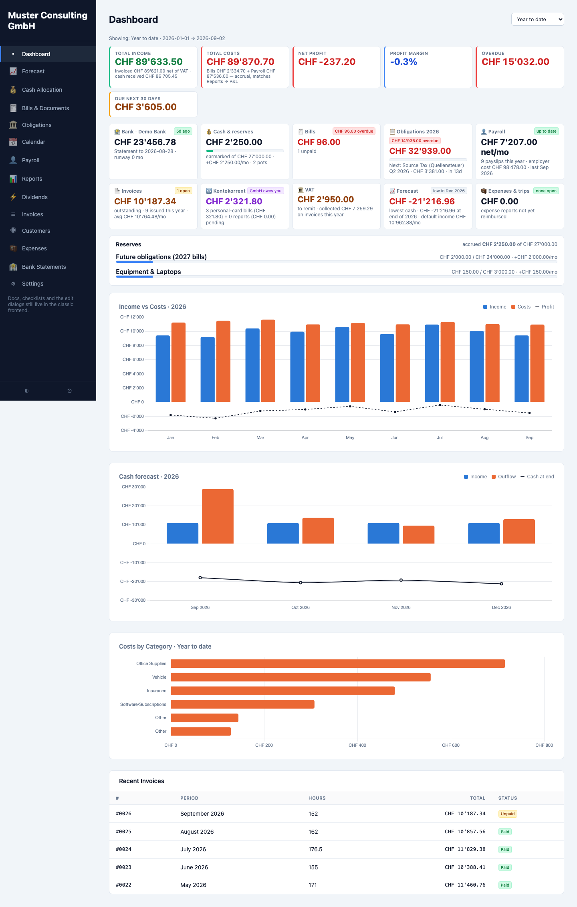

# Swiss GmbH Cockpit

Self-hosted financial operations suite for a founder-run Swiss GmbH — invoicing, bills & receipts, Swiss payroll (AHV/ALV/BVG/UVG/KTG/Quellensteuer), obligations tracking, bank-statement reconciliation (CAMT.053), VAT, cash forecasting, dividend planning and an owner Kontokorrent — in one small FastAPI + vanilla-JS app.

> **All data in this repository is fictional.** Company, people, vendors, amounts and documents are invented demo data (`seed_demo.py`). The Swiss payroll/tax mechanics are real; the numbers are not anyone's.



## What it does

- **Dashboard** — accrual P&L cards, a per-page recap strip (one tile per module, each with its own settings), income-vs-costs and cash-forecast charts, anomaly detection on bill amounts. Fully customizable (widgets, colors, sizes, order).
- **Invoicing** — numbered PDF invoices with payment block, paid-status tracking that auto-mirrors into income entries.
- **Bills & Documents** — receipt uploads with categories, recurrence templates, FX bills, "paid from personal card" tracking, a segmented search bar with a small query language (`"exact phrase"`, `>1000`, `2026-07`, `q2`, `unpaid`).
- **Swiss payroll** — payslip engine (AHV/ALV employee+employer, BVG, UVG, KTG, FAK, source tax), PDF payslips, and generation that also books the *payment side* as obligations.
- **Obligations** — AHV akonto, BVG, VAT, corporate tax, fiduciary fee … each with a period **due date** and a separate **payable date** (when the bill actually arrives), grouped by payment day. Overdue/upcoming everywhere in the app runs on the payable date.
- **Bank statements** — CAMT.053 / CSV import, opening/closing verification, transaction classification (salary vs owner withdrawals vs reimbursements), cross-statement Kontokorrent check, Excel export of the full history.
- **Cash Allocation** — the real bank balance split into virtual envelopes (reserve pots with monthly accruals), plus a month-by-month plan of what leaves the bank until year end.
- **Forecast** — per-calendar-year cash projection: editable expected income per month − net salary − obligations on their payable date − bills − pot accruals; later years carry cash forward.
- **Reports** — quarterly summary, VAT tracker, corporate-tax estimate, accountant package (ZIP of everything the fiduciary needs).
- **Dividends** — multi-year distribution planner with Swiss partial-taxation math (qualified holding) and withholding-tax timing.
- **Settings** — display currency & number format (any BCP-47 locale), company branding, hourly rate, VAT rate, the invoice identity block, dividend-tax parameters and renameable obligation labels (server-backed, honored by both frontends). What stays Swiss and why: [ARCHITECTURE.md → Localization boundary](ARCHITECTURE.md#localization-boundary).
- **Extras** — travel expense reports with reimbursement flow, trips log, per-page display setup, dark mode, keyboard shortcuts, in-app docs viewer, optional AI chat over the app's own API (bring your own `ANTHROPIC_API_KEY`).

## Quick start

```bash
python3 -m venv .venv
.venv/bin/pip install -r requirements.txt
.venv/bin/python seed_demo.py     # schema + fictional demo data (via the app's own API)
.venv/bin/python app.py           # http://127.0.0.1:8000 — password: demo
.venv/bin/python -m pytest tests/test_smoke.py -q
```

Single SQLite file (`invoices.db`), no build step, no frontend framework.

## Architecture

```
app.py                  assembles templates/parts/*.html, mounts routes/*, serves static/
db.py                   schema + migrations + startup self-heal (one SQLite file)
routes/                 ~25 focused APIRouter modules (invoicing, payroll, bank, …)
static/js/01…09*.js     classic scripts, shared globals, no bundler
static/app.css          one stylesheet on a token design system (light + dark)
design-system/          canonical.css + reference pages + migration notes
design-audit/           Playwright screenshot harness (31 shots, both themes)
docs/                   in-app documentation (feeds the viewer, checklists & AI chat)
tests/test_smoke.py     172 route/behavior smoke tests
cockpit-next/           Next.js 15 frontend (port in progress: auth + dashboard) over the same API
```

Design rules worth stealing: every color comes from semantic token families (`--ok/--danger/--warn/--info/--owner`), every CHF figure is `tabular-nums`, charts read their palette from CSS tokens at render time so the theme toggle re-skins them, and "color = meaning" is enforced (green success, red danger, purple = owner money — never decoration).

Bookkeeping invariants the code protects: invoice **subtotal** is revenue (VAT belongs to the tax office); payroll cost = **issued payslips**, never settings × months; obligations are the *payment side* of costs already booked — they are never added to P&L; the owner Kontokorrent excludes wages and reimbursement transfers.

## Screenshots

| | |
|---|---|
|  |  |
|  |  |

## Next.js frontend

`cockpit-next/` is an incremental React/TypeScript port of the frontend over the same FastAPI backend — typed API client, the canonical CSS reused verbatim, charts reading their palette from the design tokens. All thirteen pages are ported (Dashboard, Forecast, Cash, Bills, Obligations, Calendar, Payroll, Reports, Dividends, Invoices, Customers, Expenses, Bank); create/edit dialogs and the docs viewer remain in the classic frontend — see [cockpit-next/README.md](cockpit-next/README.md).



## Docs

[MANUAL](docs/MANUAL.md) — how to actually run your GmbH with it ·
[ARCHITECTURE](ARCHITECTURE.md) — how it's built and the bookkeeping invariants ·
[DEPLOY](DEPLOY.md) — local, Docker (`docker compose up`), tunnels ·
[CONTRIBUTING](CONTRIBUTING.md) — design-system and code rules.

## Configuration

| Env var | Default | Purpose |
|---|---|---|
| `ADMIN_PASSWORD` | `demo` | Login password (app refuses to bind non-localhost with the default) |
| `SESSION_SECRET` | random per start | JWT signing secret |
| `HOST` / `PORT` | `127.0.0.1` / `8000` | Bind address |
| `LLM_PROVIDER` + `ANTHROPIC_API_KEY` | off | Optional AI chat (`ollama` for local) |

## License

[MIT](LICENSE).
